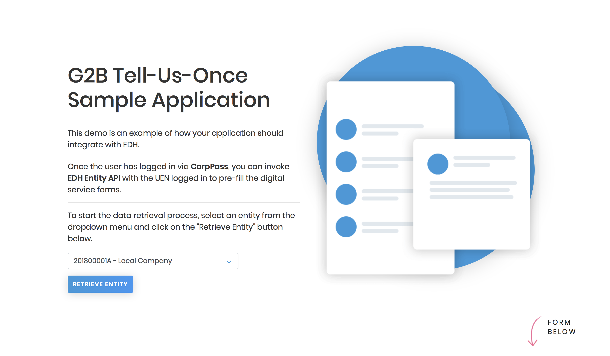

## EDH Demo App Setup

### 1.1 Install Node and NPM

In order for the demo application to run, you will need to install Node and NPM.

Follow the instructions given by the links below depending on your OS.

-   [Install Node and NPM for Windows](http://blog.teamtreehouse.com/install-node-js-npm-windows)
-   [Install Node and NPM for Linux](http://blog.teamtreehouse.com/install-node-js-npm-linux)
-   [nstall Node and NPM for Mac](http://blog.teamtreehouse.com/install-node-js-npm-mac)

### 1.2 Run NPM install

Run the following command in the folder you unzipped the application:

    npm install

### 1.3 Start the Application

**For Linux/MacOS**

Execute the following command to start the application:

      ./start.sh

**For Windows**

Execute the following command to start the application:

      .\start.bat

**Access the Application on Your Browser**
You should be able to access the sample application via the following URL:

    http://localhost:3001

* * *

### v1.0.0 APIs (LATEST)

[EDH Entity TUO Specifications](https://public.cloud.myinfo.gov.sg/edh/edh-tuo-specs.html)

**For Linux/MacOS**

Edit the `start.sh`. Look for `SANDBOX ENVIRONMENT`, Comment out these configurations,

    # SANDBOX ENVIRONMENT (no PKI digital signature)
    # export AUTH_LEVEL=L0
    # export EDH_API_ENTITY='https://sandbox.api.edh.gov.sg/gov/v1/entity-sample'

Look for `TEST ENVIRONMENT`, uncomment these configurations,

    # TEST ENVIRONMENT (with PKI digital signature)
    export AUTH_LEVEL=L2
    export EDH_API_ENTITY='https://test.api.edh.gov.sg/gov/v1/entity'

Execute the following command to start the application:

      ./start.sh

**For Windows**

Edit the `start.bat`. Look for `SANDBOX ENVIRONMENT`, comment out these configurations,

    rem SANDBOX ENVIRONMENT (no PKI digital signature)
    rem set AUTH_LEVEL=L0
    rem set export EDH_API_ENTITY=https://sandbox.api.edh.gov.sg/gov/v1/entity-sample

Look for `TEST ENVIRONMENT`, uncomment these configurations,

    rem TEST ENVIRONMENT (with PKI digital signature)
    set AUTH_LEVEL=L2
    set EDH_API_ENTITY=https://test.api.edh.gov.sg/gov/v1/entity

Execute the following command to start the application:

      .\start.bat

* * *

## Reporting issues

You may contact <mailto:support@edh.gov.sg> for any other technical issues, and we will respond to you within 5 working days.
